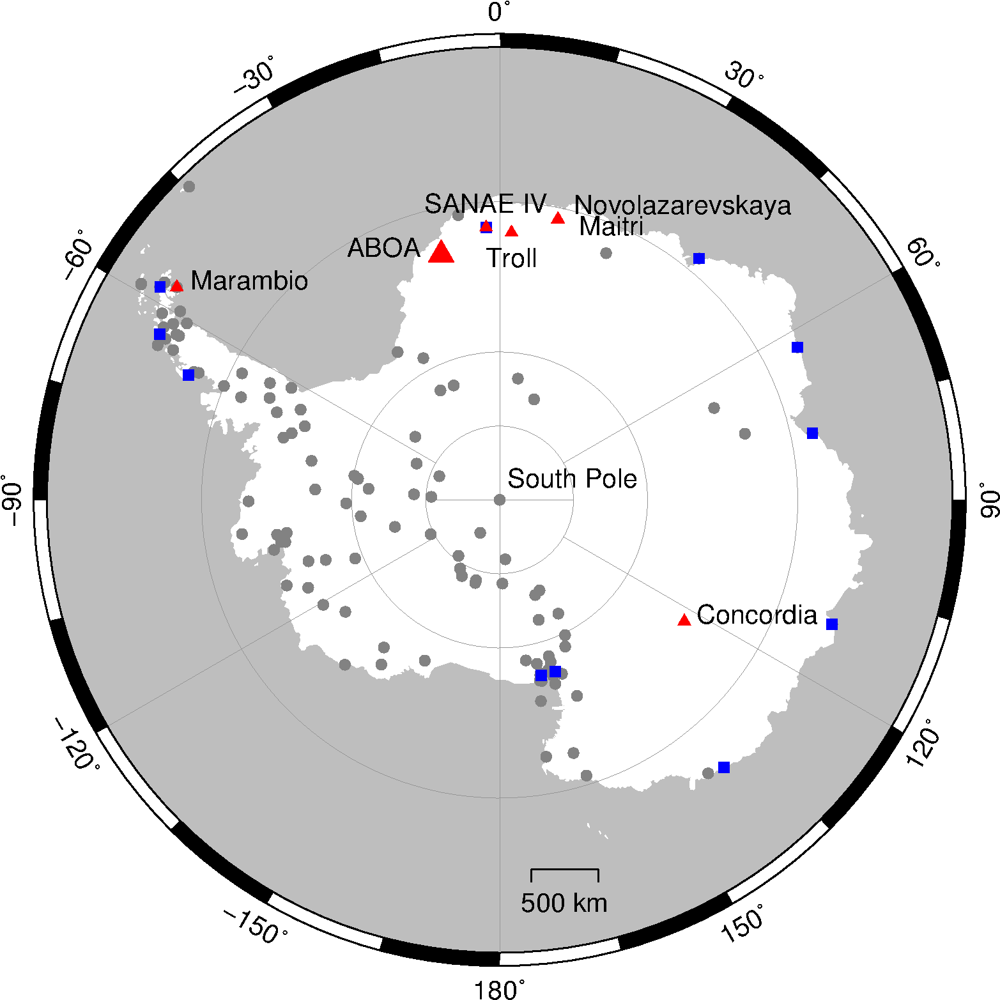

# aboa
GPS time time series analysis using Fourier Transform and Singular Spectral Analysis

Took Help as a Reference from this paper: https://www.sciencedirect.com/science/article/pii/S0273117722002022

5000 daily PPP positions and 15-year long time series are also available. See the supplement material or [here](rs10121937/supplement).

  

